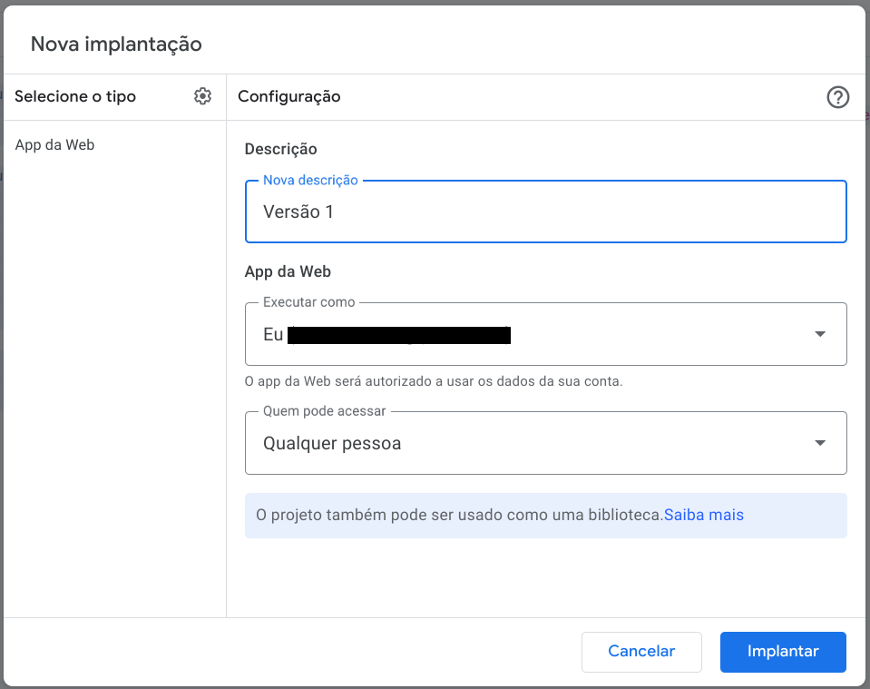

# exemplo-webpage-appscript-planilha

Repositório com exemplo de utilização do Google Planilhas para salvar os dados de um formulário de uma página web usando Apps Scripts do Google.

## Tutorial

### Google Planilhas

Primeiramente crie uma planilha no google planilhas com a estrutura de colunas que você deseja.

### Google Apps Scripts

Acesse o menu Extensões > Apps Script.

Após isso cole o conteúdo do arquivo [script_appscript.txt](./src/scripts/script_appscript.txt) no editor e salve o script usando o ícone do disquete.

Depois clique no botão "Implantar" e escolha opção "Nova implantação".

Na tela selecione o tipo "App da Web" (clique na engrenagem se necessário), e preencha os dados "Nova descrição", "Executar como" e "Quem pode acessar", e clique em "Implantar" no final da tela.

Caso a operação ocorra com sucesso serão apressentadas as seguintes informações: Código de implantação e App da Web - URL.

Copie e guarde esses dados.

### Página Web

Crie uma página web semelhante ao que foi feito nesse repositório no arquivo [index.html](./src/index.html).

No primeiro argumento da função fetch dentro da tag Script da página HTML coloque a URL que você guardou passo anterior.

Após preencher os dados e clicar em enviar um alerta de confirmação deve ser exibido, e os dados enviados deve estar na planilha do google criada.

## Detalhes adicionais

- A ordem das colunas criadas na planilha é importante, pois o script no Google Apps Script usa a ordem para popular as informações.

- No Apps Script, o nome das funções é importante, pois é assim que a funcionalidade sabe o que chamar para cada meétodo HTTP.

- Ao criar uma nova implantação, preencha as informações "Executar como" e "Quem pode acessar" como for melhor para sua necessidade. Pesquise mais se necessário para entender o funcionamento.

- O Apps Script trabalha com versões, portanto ao implantar uma versão do seu script, se precisar alterar você deverá fazer uma nova implantação gerando assim a próxima versão. Lembre-se de a cada versão gerada, alterar a URL na página Web.